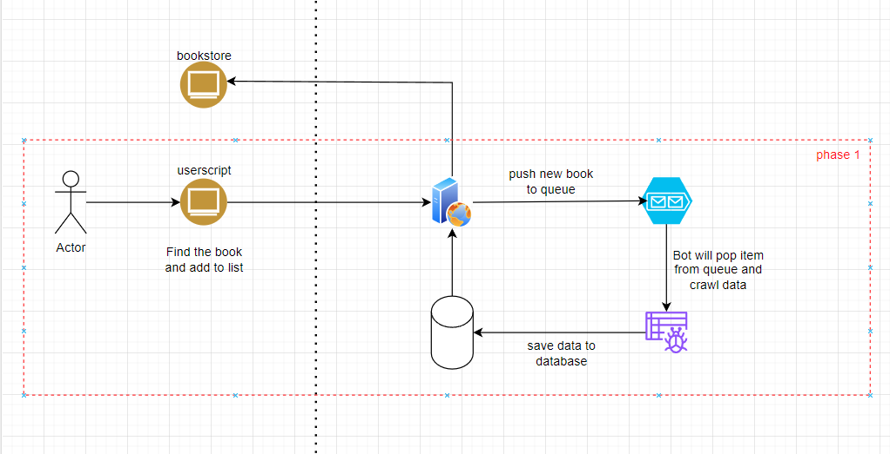
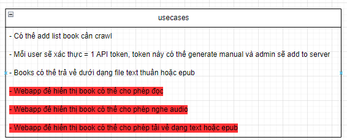

# Bookcrawler 

This application is a webapp for crawl the books from multiple sources

- For details, please check the [#bookcrawler.drawio](#bookcrawler.drawio)

### Usecase this application working for

### APIs:

| Method | API Url |
|--------| --------|
| GET | /health | 
| POST | /auth | 
| GET | /book/queue | 
| POST | /book/queue | 
| DELETE | /book/queue/:id | 
| POST | /book/download/:id | 

### Todo:

- [ ] Create database 
- [ ] Create webserver
- [ ] Create bot crawler
- [ ] Create userscript for add book
